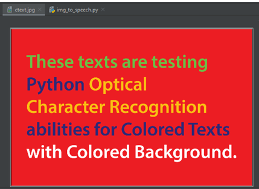
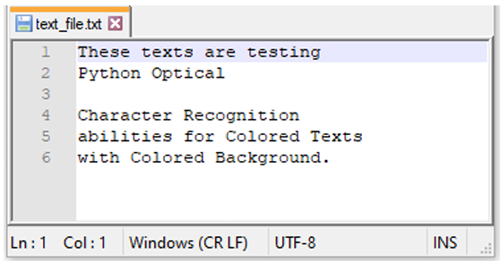

# Conversion of Image to Text as Well as Speech for Professional Use

A Python-based accessibility tool that converts a text-bearing image into
machine-readable text (OCR), then converts that text into spoken audio
(Text-to-Speech), with optional translation into another language.

This project was originally developed as a B.Sc. (Engg.) final year
project in the Department of Information and Communication Technology,
Comilla University (2020), aimed at helping visually impaired and speech
impaired users access written information more independently. The
original prototype was deployed on a Raspberry Pi 3 with a Pi camera,
microphone, and speaker.

## Motivation

Millions of people worldwide are visually impaired or unable to speak.
This project explores how commodity hardware (a camera + a low-cost
single-board computer) combined with open-source Python libraries can:

- Let a visually impaired person "hear" printed text (Image → Text → Speech)
- Let a speech-impaired person "speak" by typing/scanning text that is
  then read aloud (Text → Speech)
- Optionally translate the recognized text into another language before
  speaking it

## How it works

```
 ┌─────────────┐     ┌───────────────┐     ┌────────────────┐     ┌───────────────┐
 │ Input Image │ --> │ Pre-processing │ --> │ OCR (Tesseract) │ --> │  Text file    │
 └─────────────┘     └───────────────┘     └────────────────┘     └───────┬───────┘
                                                                            │
                                                            (optional translation)
                                                                            │
                                                                            v
                                                                    ┌───────────────┐
                                                                    │ Speech (TTS)  │
                                                                    └───────────────┘
```

1. **Pre-processing** (`src/image_to_text.py`) — grayscale conversion,
   noise reduction, and contrast enhancement so the OCR step works
   reliably on both plain and colored/noisy-background images.
2. **OCR** — text is extracted via [Tesseract OCR](https://github.com/tesseract-ocr/tesseract)
   through the `pytesseract` Python wrapper, and saved to a `.txt` file.
3. **Text-to-Speech** (`src/text_to_speech.py`) — the text file is read
   and converted to speech offline via `pyttsx3`. Translation before
   speaking is supported via `googletrans`.

## Project structure

```
image-text-speech-converter/
├── README.md
├── requirements.txt
├── src/
│   ├── image_to_text.py     # Image -> Text (OCR) module
│   ├── text_to_speech.py    # Text -> Speech (TTS) module
│   └── main.py               # End-to-end pipeline / CLI entry point
└── samples/
    ├── input_images/         # Put sample test images here
    └── output/                # Generated .txt / audio output
```

## Installation

1. Install the Tesseract OCR engine (required by `pytesseract`):
   - **Ubuntu/Debian:** `sudo apt install tesseract-ocr`
   - **macOS:** `brew install tesseract`
   - **Windows:** download the installer from the
     [Tesseract project](https://github.com/UB-Mannheim/tesseract/wiki)

2. Clone this repo and install the Python dependencies:
   ```bash
   git clone <your-repo-url>
   cd image-text-speech-converter
   pip install -r requirements.txt
   ```

## Usage

Run the full pipeline on an image:

```bash
python src/main.py samples/input_images/example.jpg
```

Translate the recognized text into Bangla before speaking it:

```bash
python src/main.py samples/input_images/example.jpg --dest-lang es
```

Or run each stage independently:

```bash
# Image -> Text only
python src/image_to_text.py samples/input_images/example.jpg -o samples/output/example.txt

# Text -> Speech only
python src/text_to_speech.py samples/output/example.txt -o samples/output/example.mp3
```
## Sample Input & Output

**Input:** an image containing colored text on a colored background,
demonstrating that OCR still works when text isn't simple black-on-white.



*Figure: Image containing colored text with a colored background*

**Output:** the recognized text, extracted via OCR and saved to a `.txt` file.



*Figure: Extracted text saved to text_file.txt*
## Original project context

- **Title:** Conversion of Image to Text as Well as Speech for Professional Use
- **Institution:** Department of Information and Communication Technology, Comilla University
- **Author:** Sharmin Akter
- **Supervisor:** Md Ariful Islam — Assistant Professor, Department of Robotics and Mechatronics Engineering, University of Dhaka (Ex-Lecturer, Dept. of ICT, Comilla University)
- **Supervisor:** Md Ariful Islam — Assistant Professor, Department of Robotics and Mechatronics Engineering, University of Dhaka (Ex-Lecturer, Dept. of ICT, Comilla University)
- **Original hardware:** Raspberry Pi 3, Pi Camera, microphone, speaker
- **Original tools:** Python 3, Tesseract OCR, Pytesseract, PIL, pyttsx3, Google TTS/Translate

## References

This project builds on the methodology described in the following works:

1. Shah, T., & Parshionikar, S. (2019). *Efficient Portable Camera Based Text to Speech Converter for Blind Person*. International Conference on Intelligent Sustainable Systems (ICISS 2019).
2. *A Text Reader for the Visually Impaired using Raspberry Pi*. Proceedings of the Second International Conference on Computing Methodologies and Communication (ICCMC 2018).
3. Rithika, H., & Santhoshi, B. N. *Image Text To Speech Conversion In The Desired Language By Translating With Raspberry Pi*.
4. Smith, R. (2007). *An Overview of the Tesseract OCR Engine*. International Conference on Document Analysis and Recognition.
5. Rice, S. V., Jenkins, F. R., & Nartker, T. A. (1995). *The Fourth Annual Test of OCR Accuracy*. Information Science Research Institute.
6. Bhargava, A., Nath, K. V., Sachdeva, P., & Samel, M. (2015). *Reading Assistant for the Visually Impaired*. International Journal of Current Engineering and Technology (IJCET), 5(2).
7. Devi, V. A., & Baboo, S. S. (2014). *Optical Character Recognition on Tamil Text Image Using Raspberry Pi*. International Journal of Computer Science Trends and Technology (IJCST), 2(4).
8. Kumari, K. N., & Reddy, M. J. (2016). *Image Text to Speech Conversion Using OCR Technique in Raspberry Pi*. International Journal of Advanced Research in Electrical, Electronics and Instrumentation Engineering (IJAREEIE), 5(5).
9. Tesseract OCR Engine — [github.com/tesseract-ocr/tesseract](https://github.com/tesseract-ocr/tesseract)

## License

MIT — see [LICENSE](LICENSE).
